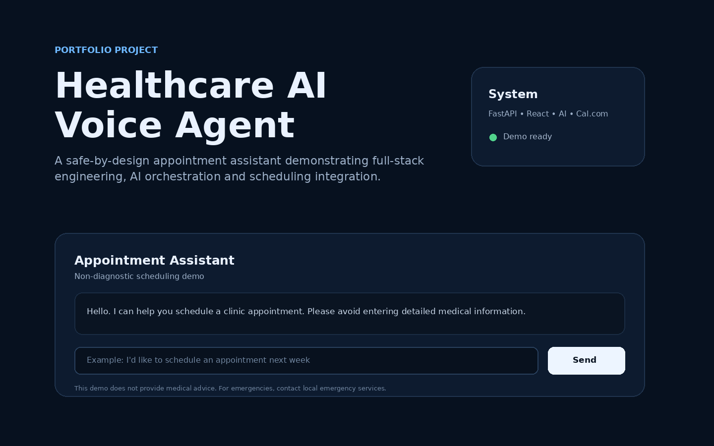

# Healthcare AI Voice Agent



A full-stack AI-assisted healthcare appointment scheduling application demonstrating **FastAPI, React, TypeScript, provider-backed AI and scheduling integrations, automated testing, containerized development, and an AWS ECS/Fargate-ready deployment design**.

> **Portfolio / demonstration project only.** This repository is not a medical device and must not be used for diagnosis, treatment, emergency triage, or storage of real protected health information (PHI) without appropriate security, privacy, legal, and compliance review.

## Engineering objectives

This project demonstrates the design of an AI-enabled application across frontend, backend, integration, testing, and infrastructure boundaries.

- Clear separation between UI, API, AI, safety, and scheduling concerns
- Provider-isolated service boundaries for LLM and scheduling integrations
- Typed frontend development with React and TypeScript
- Validated REST APIs with FastAPI and Pydantic
- Deterministic demo mode for local development and CI
- Optional live OpenAI and Cal.com provider paths
- Containerized, repeatable local development
- Automated backend and provider-integration testing
- Cloud-ready architecture designed for stateless deployment and horizontal scaling

## Architecture

```text
Patient / User
      |
      v
React + TypeScript SPA
      |
      v
FastAPI Application
      |
      +-------------------+
      |                   |
      v                   v
Safety / AI Layer     Scheduling Service
      |                   |
      v                   v
 OpenAI Responses API   Cal.com API

Production direction:

CloudFront / CDN
      |
      v
React SPA
      |
      v
Application Load Balancer
      |
      v
AWS ECS / Fargate
      |
      +--> LLM Provider
      +--> Scheduling Provider
      +--> PostgreSQL / RDS
      +--> Redis / ElastiCache
```

See [`docs/ARCHITECTURE.md`](docs/ARCHITECTURE.md) for the detailed design and [`docs/AWS_DEPLOYMENT.md`](docs/AWS_DEPLOYMENT.md) for the deployment design.

## Core capabilities

- Conversational appointment-intake API
- Safe, non-diagnostic assistant behavior
- Emergency-language guardrail before provider calls
- OpenAI Responses API integration with deterministic fallback
- Cal.com booking integration with explicit demo/live modes
- UTC normalization for scheduling requests
- Provider-failure isolation and API-safe error handling
- Health/status endpoint
- React scheduling interface
- Docker Compose development environment
- Automated backend tests
- Mocked external-provider integration tests
- GitHub Actions validation for backend tests and frontend production build
- AWS ECS/Fargate-ready container architecture

## Technology stack

| Layer | Technologies |
| --- | --- |
| Frontend | React, TypeScript, Vite |
| Backend | Python 3.12, FastAPI, Pydantic, HTTPX |
| AI | OpenAI Responses API behind an isolated LLM service |
| Scheduling | Cal.com API behind an isolated scheduling service |
| Testing | Pytest, mocked HTTPX provider tests |
| Containers | Docker, Docker Compose |
| CI/CD | GitHub Actions |
| Cloud architecture | AWS ECS / Fargate |

## Design decisions

### Isolated AI integration

AI interaction is kept behind a service boundary so providers, models, prompting strategies, and safety controls can evolve without tightly coupling them to API routes or scheduling logic. The application defaults to deterministic demo mode and can enable the live OpenAI path only when configured.

### Scheduling abstraction

Scheduling is separated from conversation logic. The application defaults to demo booking behavior and can enable a live Cal.com path through environment configuration. External provider failures are translated into controlled API errors rather than leaking raw provider responses.

### Safety-conscious boundaries

Emergency-language detection runs before the LLM provider path. The assistant is intentionally non-diagnostic, and the live OpenAI request is configured not to store the response through this application path. A production healthcare implementation would still require clinically reviewed safety controls, formal privacy/compliance review, access control, audit logging, encryption, retention policies, and approved data-processing agreements.

### Cloud-ready deployment

The backend is structured for stateless container deployment. A production evolution can place containers behind an Application Load Balancer on ECS/Fargate and introduce managed persistence, caching, secrets management, centralized logging, monitoring, and infrastructure as code.

## Configuration modes

The application is safe to run locally without external provider credentials.

```env
LLM_MODE=demo
CALCOM_MODE=demo
```

To exercise live provider paths, configure the corresponding credentials in a local `.env` file or managed secret store and switch the required mode to `live`. Never commit real API keys to the repository.

## Quick start

```bash
git clone https://github.com/amsm2025/healthcare-ai-voice-agent.git
cd healthcare-ai-voice-agent
cp .env.example .env
docker compose up --build
```

| Service | Local address |
| --- | --- |
| Backend API | `http://localhost:8000` |
| OpenAPI / Swagger | `http://localhost:8000/docs` |
| Frontend | `http://localhost:5173` |

## Run backend without Docker

```bash
cd backend
python -m venv .venv
```

Windows PowerShell:

```powershell
.venv\Scripts\Activate.ps1
pip install -r requirements.txt
uvicorn app.main:app --reload
```

## Run frontend without Docker

```bash
cd frontend
npm install
npm run dev
```

## Testing

Backend tests are designed to run without real provider credentials or network calls.

```bash
cd backend
python -m pytest
```

The current suite covers health checks, scheduling intent, emergency guardrails, demo booking behavior, mocked OpenAI provider requests, mocked Cal.com booking requests, UTC conversion, and live-mode credential failure handling.

Validate the production frontend build with:

```bash
cd frontend
npm run build
```

GitHub Actions runs backend tests and the frontend production build on repository changes.

## Security and healthcare considerations

Before this architecture handles real healthcare data, a production implementation should include authentication and authorization, least-privilege access, encryption, managed secrets, audit logging, minimum-necessary data collection, retention policies, approved providers, applicable privacy/compliance review, appropriate BAAs/DPAs, threat modeling, and security testing.

No real PHI is required for this portfolio demonstration.

## Project status

This repository is a working engineering demonstration with implemented provider integration paths and automated tests. It remains a portfolio system rather than a production clinical application.

### Implemented

- [x] OpenAI provider-backed LLM path with safe deterministic fallback
- [x] Cal.com provider-backed booking path with demo fallback
- [x] Provider integration tests with mocked network calls
- [x] Backend API tests and frontend production-build validation
- [x] Dockerized local development and AWS deployment design

### Roadmap

- [ ] Add voice-provider integration
- [ ] Add PostgreSQL persistence
- [ ] Add Redis-backed session state
- [ ] Add OAuth / OIDC authentication
- [ ] Add RAG for approved clinic FAQs
- [ ] Add structured observability and tracing
- [ ] Add Terraform infrastructure
- [ ] Add production-grade secrets management
- [ ] Add production PHI controls following formal compliance review

## Documentation

- [`Architecture`](docs/ARCHITECTURE.md)
- [`AWS deployment`](docs/AWS_DEPLOYMENT.md)

## Author

**Angel Martin Manalansan**  
Senior Full Stack Engineer | AI-enabled Applications | Enterprise Systems

GitHub: [amsm2025](https://github.com/amsm2025)
